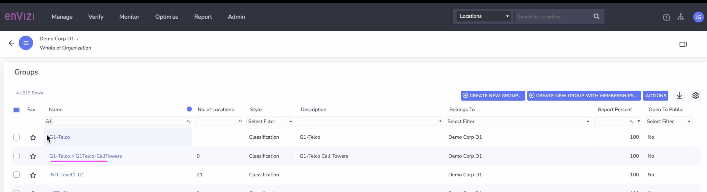

# Envizi Data Loading

This blog explains about the step-by-step instructions to create the following.

- Group
- Sub Group
- Location
- Account
- Data

## Contents

- [1. Group](#1-Group)
- [2. Sub Group](#2-Sub-Group)
- [3. Location ](#3-Location)
- [4. Account ](#4-Account)
- [5. Data](#5-Data)

## 1. Create Group and SubGroup

#### 1.1 Create Group

1. Click on `Manage > Groups` 

It shows the Groups page.

2. Click on `Create New Group` button.

3. Fill in details as below. 

- Group Type :  `Classification`
- Belongs To : The Org name of the account. Here `Demo Corp D1`
- Name :  Give any name for the Group. Ex: `G1-Telco`
- Report Percent :  100

4. Click on `Save` button.

A new Group called `G1-Telco` got created.

#### 1.2 Create Sub Group 1

Here are we are going to create a new SubGroup called `G1-Telco-CellTowers` under the group `G1-Telco`

1. Fill in details as below. 

- Group Type :  `Classification`
- Belongs To : The Org name of the account. Here `Demo Corp D1`
- Part Of :  `G1-Telco` (the parent group)
- Name :  Give any name for the Group. Ex: `G1-Telco-CellTowers`
- Report Percent :  100

2. Click on `Save` button.

A new Sub Group called `G1-Telco-CellTowers` got created.

#### 1.3 Create Sub Group 2

Here are we are going to create a new SubGroup called `G1-Telco-DataCentres` under the group `G1-Telco`

1. Fill in details as below. 

- Part Of :  `G1-Telco` (the parent group)
- Name :  Give any name for the Group. Ex: `G1-Telco-DataCentres`

A new Sub Group called `G1-Telco-DataCentres` got created.

## 2. Location

#### 2.1 Create Location 1

1. Click on `Manage > Locations` 

It shows the Locations page.

2. Click on `Create New Location` button.

3. Fill in details as below. 

- Location Type :  `Cell Tower`
- Name :  Give any name for the Location. Ex: `G1-Tower-2000`
- Country :  `United States`
- Region :  `illinois : state United States`
- Group :  Choose the sub group created before. Ex:  `G1-Telco-CellTowers`

4. Click on `Save` button.

A new Location called `G1-Towers-2000` got created.

#### 2.2 Create Location 2

Similarly create a new location called `G1-Tower-2001` under the group  `G1-Telco-CellTowers`

#### 2.3 Create Location 3

Similarly create a new location called `G1-DC-2000` under the group  `G1-Telco-DataCenters`

#### 2.3 Create Location 4

Similarly create a new location called `G1-DC-2001` under the group  `G1-Telco-DataCenters`

#### 2.4 Location List

All the above crated Locations got created and available here..

## 3. Account

## 4. Group Summary

## 5. Location Details

## 6. Load Account data

## 7. Location Performance

## 9. Account Summary

## 9.  Load Account data 2

## 10.  Load Account data 3

