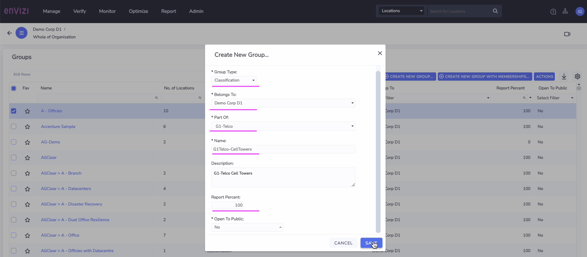
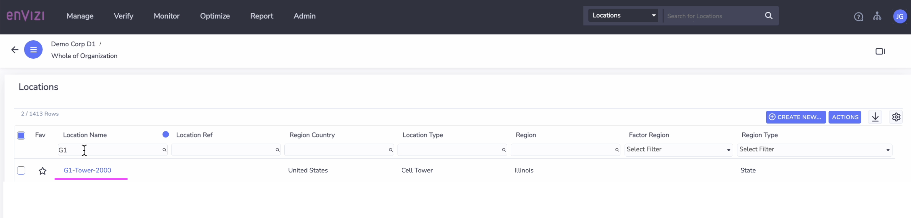
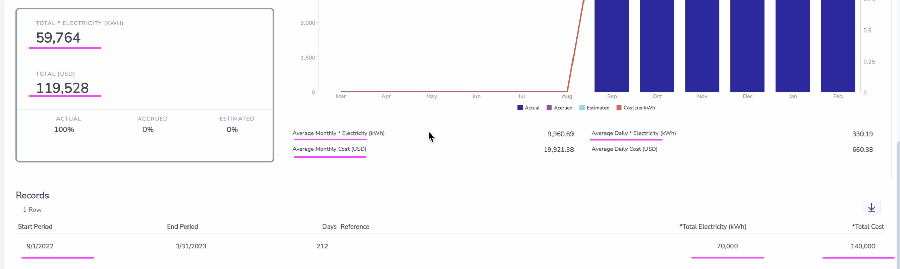

# Envizi Data Loading

This blog explains about the step-by-step instructions to create the following.

- Group
- Sub Group
- Location
- Account
- Data

## Contents

- [1. Group](#1-Group)
- [2. Sub Group](#2-Sub-Group)
- [3. Location ](#3-Location)
- [4. Account ](#4-Account)
- [5. Data](#5-Data)

## 1. Group

## 2. Sub Group

## 3. Location

## 4. Account

## 5. Group Summary

## 6. Location Details

## 7. Load Account data

## 8. Location Performance

## 9. Account Summary

## 9.  Load Account data 2

## 10.  Load Account data 3

